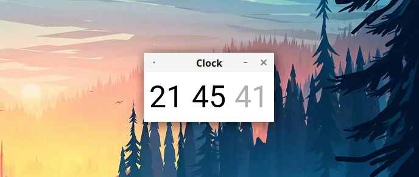

  <h1 align="center">Simple clock</h1>

---

### How to use it

Firstly, download folder `code`.  
Secondly, add full path to `launch.desktop`.  
Then add this file to your Desktop.  

### Installing the necessary

Install Python from [python.org](https://python.org)
